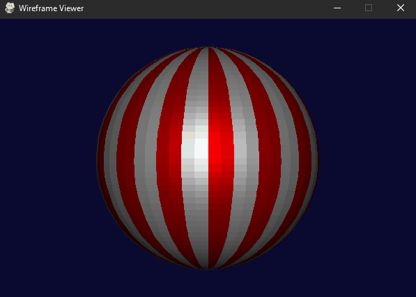

# LightingAndShadingModel

This project shows how to screate simple 3D lighting usingthe phong model (demonstrated with a sphere and directional light).

To review the implementation, see [lab-08.py](lab-08.py).

## Demo

## Controls

